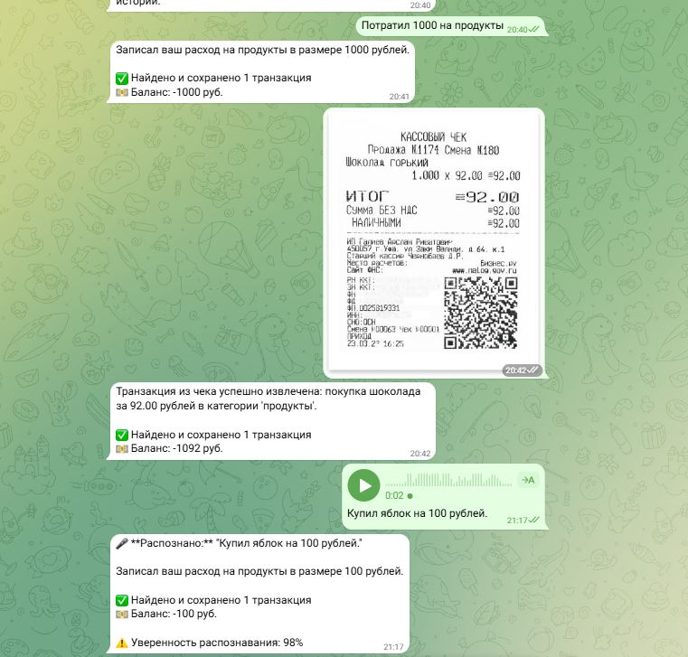

# Отчёт о выполнении задания

## Название проекта

**Персональный финансовый советник** — Telegram-бот для учета доходов и расходов с интеграцией LLM и мультимодальной обработкой данных.

### Краткое описание

Бот автоматически извлекает финансовые транзакции из текстовых сообщений, голосовых записей и изображений чеков, ведет учет доходов и расходов, предоставляет отчеты о балансе и статистике по категориям. Реализован на базе LLM-ассистента с поддержкой structured output для надежного извлечения структурированных данных.

## Вариант задания

**Расширенный вариант** — реализована полная мультимодальная обработка:
- ✅ Текстовые сообщения
- ✅ Голосовые сообщения с транскрибацией
- ✅ Изображения (чеки, скриншоты)
- ✅ Интеграция с локальными моделями через Ollama
- ✅ Поддержка переключения между облачными и локальными провайдерами

## Реализованные возможности

### Основной функционал

- [x] **Извлечение транзакций из текстовых сообщений**
  - Автоматическое распознавание сумм, дат, категорий
  - Поддержка различных форматов ввода
  - Нормализация валюты и дат

- [x] **Обработка голосовых сообщений**
  - Транскрибация речи в текст через локальную модель Whisper
  - Поддержка русского языка
  - Проверка качества распознавания (confidence score)
  - Автоматическое извлечение транзакций из распознанного текста

- [x] **Обработка изображений**
  - Распознавание текста на чеках и скриншотах через VLM
  - Извлечение транзакций из изображений
  - Поддержка различных форматов изображений

- [x] **Автоматическая категоризация транзакций**
  - Базовые категории: продукты, рестораны, такси, транспорт, образование, путешествия, развлечения, здоровье, одежда, другие
  - Автоматическое определение категории LLM
  - Возможность создания новых категорий

- [x] **Отчеты о балансе и статистике**
  - Команда `/balance` — баланс, доходы, расходы
  - Статистика по категориям за все время
  - Команда `/transactions` — список всех транзакций с сортировкой по дате

- [x] **Поддержка локальных моделей**
  - Интеграция с Ollama для работы без интернета
  - Переключение между OpenRouter и Ollama через конфигурацию
  - Поддержка различных моделей для текста и изображений

### Дополнительные возможности

- [x] **Structured output** — использование Pydantic для валидации ответов LLM
- [x] **История диалогов** — контекстные ответы на основе предыдущих сообщений
- [x] **Обработка ошибок** — корректная обработка ошибок API и пользовательские сообщения
- [x] **Логирование** — детальное логирование всех операций
- [x] **Автозапуск** — настройка systemd для автоматического запуска при перезагрузке сервера

## Технологический стек

### Языки и инструменты

- **Python 3.12** — основной язык разработки
- **uv** — современный менеджер зависимостей и виртуальных окружений (замена pip/venv)
- **Make** — автоматизация сборки и запуска

### Библиотеки и фреймворки

- **aiogram 3.22.0** — асинхронный фреймворк для Telegram Bot API
- **openai 2.6.1** — клиент для работы с LLM через OpenRouter/Ollama (единый интерфейс)
- **pydantic 2.11.10** — валидация данных и structured output для LLM
- **python-dotenv 1.2.1** — работа с переменными окружения
- **openai-whisper 20231117+** — локальная модель Whisper для транскрибации речи
- **aiohttp 3.12.15** — асинхронные HTTP запросы

### Используемые модели

#### Для обработки текста
- **OpenRouter**: `openai/gpt-oss-20b:free` (облачная)
- **Ollama**: `gpt-oss:20b` (локальная, ~13 GB)

#### Для обработки изображений (Vision)
- **OpenRouter**: `qwen/qwen2.5-vl-32b-instruct` (облачная)
- **Ollama**: `qwen3-vl:8b-instruct` (локальная, ~6.1 GB)

#### Для транскрибации речи (STT)
- **Whisper**: `base` (локальная модель, ~150 MB)
- Поддержка OpenAI Whisper API (при доступности в регионе)

### Инфраструктура

- **Systemd** — управление сервисом на Linux
- **FFmpeg** — обработка аудиофайлов для Whisper
- **Git** — контроль версий

## Инструменты AI-driven разработки

### IDE и редакторы

- **Cursor** — AI-powered IDE с интеграцией LLM для автодополнения и рефакторинга
- **Git** — распределенная система контроля версий

### LLM модели для разработки

- **Claude (Anthropic)** — через Cursor для генерации кода, рефакторинга и отладки
- **GPT-4** — для решения сложных задач и архитектурных решений

### Использование AI в разработке

- Генерация кода обработчиков и сервисов
- Создание документации и комментариев
- Рефакторинг и оптимизация кода
- Отладка и решение проблем
- Написание тестов и примеров использования

## Скриншоты работы

### Интерфейс бота

*Демонстрация работы бота в Telegram: обработка текстовых сообщений, голосовых записей и изображений*

## Облачный сервер

### Провайдер и характеристики

- **IP адрес**: 195.209.210.204
- **MAC адрес**: fa:16:3e:ab:21:fb
- **Наименование**: mb2512new1
- **ОС**: Ubuntu 22.04 LTS
- **Ядро**: Linux 6.8.0-85-generic

### GPU и ресурсы

- **CPU**: x86_64
- **Память**: Достаточно для работы Ollama и Whisper
- **GPU**: Не указано (CPU-only режим)

### Установленные модели Ollama

1. **gpt-oss:20b** (~13 GB)
   - Модель для обработки текстовых сообщений
   - Поддержка structured output
   - Используется для извлечения транзакций

2. **qwen3-vl:8b-instruct** (~6.1 GB)
   - Vision-language модель для обработки изображений
   - Распознавание текста на чеках
   - Извлечение транзакций из изображений

### Установленные модели Whisper

- **base** (~150 MB)
   - Локальная модель для транскрибации речи
   - Поддержка русского языка
   - Быстрая обработка голосовых сообщений

### Конфигурация сервисов

- **Ollama**: Запущен как systemd сервис на порту 11434
- **Telegram Finance Bot**: Запущен как systemd сервис с автозапуском
- **FFmpeg**: Установлен для обработки аудио

## Основные вызовы и решения

### Вызов 1: Недоступность OpenAI API в регионе сервера

**Проблема**: OpenAI Whisper API возвращал ошибку 403 "unsupported_country_region_territory" при попытке транскрибации голосовых сообщений.

**Решение**: 
- Реализован fallback на локальную модель Whisper через библиотеку `openai-whisper`
- Добавлена поддержка переключения между провайдерами через конфигурацию `STT_PROVIDER`
- Установлен FFmpeg для обработки аудиофайлов
- Использована модель `base` для баланса между качеством и скоростью

**Результат**: Голосовые сообщения успешно транскрибируются локальной моделью с confidence ~0.98.

### Вызов 2: Интеграция голосовых сообщений в существующий pipeline

**Проблема**: Необходимо было интегрировать обработку голосовых сообщений так, чтобы транскрибированный текст проходил через тот же pipeline, что и обычные текстовые сообщения.

**Решение**:
- Создан отдельный обработчик `handle_voice` для голосовых сообщений
- После транскрибации текст передается в существующую функцию `get_transaction_response_text`
- Сохранена единая логика обработки транзакций и формирования ответов
- Добавлена информация о confidence в ответ пользователю

**Результат**: Единый pipeline обработки для всех типов сообщений, минимальное дублирование кода.

### Вызов 3: Настройка Ollama и установка больших моделей

**Проблема**: Модели Ollama (gpt-oss:20b ~13 GB, qwen3-vl:8b-instruct ~6.1 GB) требуют значительного времени для установки и большого объема дискового пространства.

**Решение**:
- Использован фоновый процесс для установки моделей (`nohup`)
- Временно переключились на OpenRouter для работы бота во время установки
- Создан скрипт для удобного переключения между провайдерами
- Настроен автозапуск Ollama через systemd

**Результат**: Бот работал на OpenRouter во время установки моделей, затем успешно переключился на Ollama.

### Вызов 4: Развертывание на новом сервере

**Проблема**: Необходимо было полностью развернуть проект на новом сервере с нуля, включая настройку SSH, установку зависимостей и конфигурацию.

**Решение**:
- Создан SSH-ключ и настроен доступ к серверу
- Разработана подробная документация по развертыванию (`docs/deployment.md`)
- Создан скрипт автоматизации развертывания (`scripts/deploy.sh`)
- Настроен systemd для автозапуска бота
- Создана инструкция по управлению сервисом (`docs/server-management.md`)

**Результат**: Полностью автоматизированный процесс развертывания с подробной документацией.

### Вызов 5: Обработка ошибок и отказоустойчивость

**Проблема**: Необходимо было обеспечить корректную обработку ошибок при недоступности API, проблемах с транскрибацией и других сбоях.

**Решение**:
- Добавлена обработка исключений на всех уровнях (API, транскрибация, обработка файлов)
- Реализованы понятные сообщения об ошибках для пользователя
- Добавлено детальное логирование для отладки
- Реализована очистка временных файлов даже при ошибках (try/finally)

**Результат**: Стабильная работа бота с корректной обработкой ошибок и информативными сообщениями.

## Что узнал нового

### 1. Работа с локальными LLM моделями через Ollama

Изучил процесс установки и настройки Ollama, работу с большими языковыми моделями локально, переключение между облачными и локальными провайдерами. Понял преимущества и ограничения локальных моделей (скорость, качество, требования к ресурсам).

### 2. Транскрибация речи с помощью Whisper

Освоил работу с библиотекой `openai-whisper` для локальной транскрибации, настройку FFmpeg для обработки аудио, оценку качества распознавания через confidence score. Узнал о различных размерах моделей Whisper и их компромиссах.

### 3. Structured Output с Pydantic и LLM

Изучил использование Pydantic моделей для валидации ответов LLM через JSON schema, работу с `response_format` в OpenAI API, обработку ошибок парсинга и валидации данных. Это обеспечило надежное извлечение структурированных данных из неструктурированного текста.

### 4. Мультимодальная обработка данных

Понял принципы работы с различными типами данных (текст, голос, изображения) в едином приложении, интеграцию разных AI-моделей (LLM, VLM, STT) в один pipeline, обработку файлов из Telegram API и работу с временными файлами.

### 5. Развертывание и DevOps практики

Освоил настройку systemd сервисов для автозапуска приложений, работу с SSH ключами и безопасным доступом к серверам, создание документации для развертывания, использование uv для управления зависимостями Python, мониторинг через journalctl и логирование.

### 6. AI-driven разработка с Cursor

Научился эффективно использовать AI-ассистента в IDE для генерации кода, рефакторинга, отладки и создания документации. Понял, как правильно формулировать запросы для получения качественного кода и как проверять и дорабатывать сгенерированные решения.

## Метрики проекта

- **Строк кода**: ~1500+ (Python)
- **Файлов в проекте**: 15+
- **Зависимостей**: 28 пакетов
- **Моделей установлено**: 3 (gpt-oss:20b, qwen3-vl:8b-instruct, whisper-base)
- **Время разработки**: ~2 недели
- **Итераций**: 6 (согласно tasklist.md)

## Заключение

Проект успешно реализован с полной поддержкой мультимодальной обработки данных. Бот работает стабильно на облачном сервере, обрабатывает текстовые сообщения, голосовые записи и изображения, извлекает транзакции и предоставляет отчеты. Реализована поддержка как облачных (OpenRouter), так и локальных (Ollama) моделей с возможностью переключения между ними.

Все требования задания выполнены, документация обновлена, код протестирован на реальных данных. Проект готов к использованию и дальнейшему развитию.

---

**Дата создания отчёта**: 14 ноября 2025  
**Версия проекта**: 0.1.0  
**Статус**: ✅ Завершено

