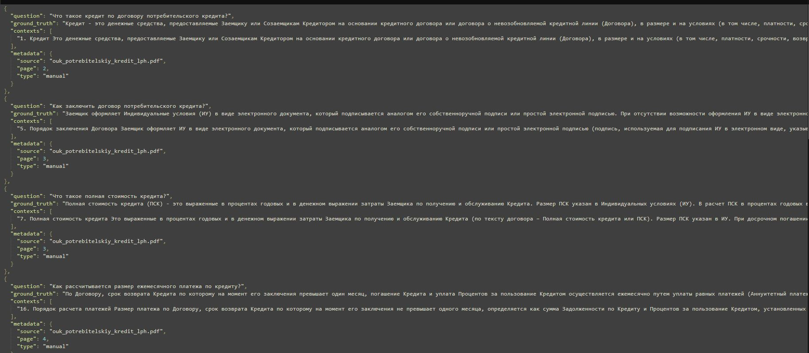

# Отчёт о выполнении задания: RAG-ассистент Сбербанка

## 1. Название проекта и краткое описание

**Название проекта:** RAG-ассистент Сбербанка

**Описание:** Telegram-бот с технологией RAG (Retrieval-Augmented Generation) для ответов на вопросы по документам Сбербанка о кредитах и вкладах. Система использует векторное хранилище для поиска релевантных документов и генерацию ответов на основе извлеченного контекста.

## 2. Вариант задания

**Вариант:** Базовый

## 3. Используемые модели и провайдеры

### 3.1. Модели для RAG (основная система)

- **LLM провайдер:** Fireworks.ai
- **LLM модель:** `accounts/fireworks/models/gpt-oss-120b`
  - Используется для генерации ответов пользователям
  - Используется для Query Transformation (улучшение поисковых запросов с учетом истории диалога)
- **Embeddings провайдер:** Fireworks.ai (OpenAI-совместимый API)
- **Embeddings модель:** `accounts/fireworks/models/qwen3-embedding-8b`
  - Используется для создания векторных представлений документов и вопросов пользователей

### 3.2. Модели для RAGAS Evaluation

Для оценки качества RAG системы используются фиксированные модели, обеспечивающие единообразную оценку:

- **LLM провайдер:** Fireworks.ai
- **LLM модель:** `accounts/fireworks/models/gpt-oss-120b`
  - Используется RAGAS метриками, требующими LLM (Faithfulness, Answer Relevancy, Answer Correctness)
- **Embeddings провайдер:** Fireworks.ai (OpenAI-совместимый API)
- **Embeddings модель:** `accounts/fireworks/models/qwen3-embedding-8b`
  - Используется для семантических вычислений в метриках (Answer Similarity, Context Recall, Context Precision)

## 4. Создание и загрузка датасета

### 4.1. Метод создания датасета

Датасет был создан **вручную** на основе содержимого документов Сбербанка:
- Общие условия предоставления, обслуживания и погашения кредитов для физических лиц по продукту "Потребительский кредит" (PDF)
- Документы о вкладах Сбербанка (PDF)
- Готовые Q&A пары из JSON файла `sberbank_help_documents.json`

Ручное создание позволило обеспечить высокое качество ground truth ответов и релевантных контекстов для каждого вопроса.

### 4.2. Размер датасета

**Количество примеров:** 8 Q&A пар

Датасет включает вопросы по различным аспектам потребительских кредитов:
- Определения основных понятий (кредит, полная стоимость кредита)
- Процедуры (заключение договора, досрочное погашение)
- Расчеты (размер платежей, начисление процентов)
- Условия и обязательства (неустойка, варианты погашения)

### 4.3. Скриншот страницы датасета в LangSmith



### 4.4. Примеры Q&A пар из датасета

#### Пример 1: Определение ключевого понятия

**Вопрос:** Что такое кредит по договору потребительского кредита?

**Ground Truth:** Кредит - это денежные средства, предоставляемые Заемщику или Созаемщикам Кредитором на основании кредитного договора или договора о невозобновляемой кредитной линии (Договора), в размере и на условиях (в том числе, платности, срочности, возвратности), предусмотренных Договором.

**Релевантный контекст:**
```
1. Кредит Это денежные средства, предоставляемые Заемщику или Созаемщикам 
Кредитором на основании кредитного договора или договора о невозобновляемой 
кредитной линии (Договора), в размере и на условиях (в том числе, платности, 
срочности, возвратности), предусмотренных Договором...
```

**Источник:** `ouk_potrebitelskiy_kredit_lph.pdf`, страница 2

#### Пример 2: Процедура досрочного погашения

**Вопрос:** Как погасить кредит досрочно?

**Ground Truth:** Заемщик вправе погашать Кредит досрочно. Досрочно погасить можно полностью весь Кредит (Задолженность по Договору) или часть Кредита. Для досрочного погашения Кредита полностью или погашения части Кредита необходимо: внести или обеспечить наличие на Счете погашения денежные средства в сумме, указанной в Заявлении о досрочном погашении Кредита; оформить Заявление о досрочном погашении Кредита. Досрочное погашение Кредита или его части осуществляется в день оформления Заявления о досрочном погашении Кредита.

**Релевантный контекст:**
```
41. Порядок досрочного погашения Кредита Заемщик вправе погашать Кредит досрочно. 
Досрочно погасить можно полностью весь Кредит (Задолженность по Договору) или 
часть Кредита. Для досрочного погашения Кредита полностью или погашения части 
Кредита необходимо: внести или обеспечить наличие на Счете погашения денежные 
средства в сумме, указанной в Заявлении о досрочном погашении Кредита...
```

**Источник:** `ouk_potrebitelskiy_kredit_lph.pdf`, страница 8

## 5. Оценка качества через RAGAS

### 5.1. Используемые метрики

Система оценки качества включает **6 метрик RAGAS**, разделенных на две категории:

#### 5.1.1. Generation метрики (качество ответов) - 4 метрики

1. **Faithfulness (Обоснованность)**
   - **Что измеряет:** Насколько ответ основан на контексте (отсутствие галлюцинаций)
   - **Важность:** Гарантирует, что ответ содержит только информацию из retrieved документов, без вымышленных фактов

2. **Answer Relevancy (Релевантность ответа)**
   - **Что измеряет:** Насколько ответ релевантен заданному вопросу
   - **Важность:** Обеспечивает, что ответ действительно отвечает на вопрос пользователя

3. **Answer Correctness (Правильность ответа)**
   - **Что измеряет:** Насколько ответ правильный по сравнению с ground truth эталоном
   - **Важность:** Проверяет соответствие ответа ожидаемому эталонному ответу

4. **Answer Similarity (Похожесть на эталон)**
   - **Что измеряет:** Семантическая похожесть ответа на ground truth
   - **Важность:** Оценивает, насколько близок по смыслу сгенерированный ответ к эталонному

#### 5.1.2. Retrieval метрики (качество поиска документов) - 2 метрики

5. **Context Recall (Полнота контекста)**
   - **Что измеряет:** Удалось ли извлечь все релевантные документы для ответа на вопрос
   - **Формула:** Какая доля информации из ground truth ответа присутствует в извлеченных документах
   - **Важность:** Показывает, не упустил ли retriever важную информацию, необходимую для правильного ответа

6. **Context Precision (Точность контекста)**
   - **Что измеряет:** Насколько извлеченные документы релевантны вопросу
   - **Формула:** Какая доля извлеченных документов действительно помогает ответить на вопрос
   - **Важность:** Показывает, не добавляет ли retriever лишний "шум" (нерелевантные документы)

### 5.2. Интерпретация метрик

- 🟢 **0.8+** - отличный результат
- 🟡 **0.6-0.8** - хороший результат
- 🔴 **<0.6** - требует улучшений

## 6. Выводы

### 6.1. Главные инсайты о качестве RAG системы

**Главный инсайт:** Качество железа и хорошие эмбеддинги быстро выявляются на тестах.

**Результаты evaluation:**

При проведении evaluation через RAGAS метрики были получены **критически низкие результаты** - почти все метрики не превышают **0.1**, что указывает на серьезные проблемы в работе RAG системы.

Это подтверждает главный инсайт о том, что проблемы быстро выявляются на тестах.

При проведении evaluation через RAGAS метрики было обнаружено, что:

1. **Важность качественных эмбеддингов**
   - Использование качественной embedding модели (`qwen3-embedding-8b` от Fireworks) напрямую влияет на метрики Retrieval (Context Recall и Context Precision)
   - Хорошие эмбеддинги обеспечивают точный семантический поиск релевантных документов
   - Плохие эмбеддинги приводят к извлечению нерелевантных контекстов, что негативно влияет на качество генерации ответов

2. **Зависимость Generation от Retrieval**
   - Метрики Generation (Faithfulness, Answer Correctness) напрямую зависят от качества поиска документов
   - Если retriever не находит правильные документы (низкий Context Recall), то даже хорошая LLM не может сгенерировать правильный ответ
   - Если retriever возвращает много шума (низкий Context Precision), LLM может запутаться и дать менее точный ответ

3. **Быстрая диагностика проблем**
   - Метрики RAGAS позволяют быстро определить, где находится проблема: в Retrieval или в Generation
   - Низкие метрики Retrieval указывают на проблемы с эмбеддингами или векторным хранилищем
   - Низкие метрики Generation при хороших Retrieval метриках указывают на проблемы с LLM или промптами

4. **Важность инфраструктуры**
   - Качество "железа" (производительность системы, скорость индексации, стабильность API) влияет на надежность RAG системы
   - Проблемы с сетью или таймаутами могут привести к неполной индексации документов или ошибкам при поиске
   - Стабильная работа всех компонентов необходима для получения консистентных результатов evaluation

5. **Критические проблемы, выявленные тестами**
   - **Результаты evaluation:** Почти все метрики показали критически низкие значения - **не превышают 0.1** (что значительно ниже минимального порога 0.6)
   - Это указывает на **фундаментальные проблемы** в RAG pipeline, которые требуют серьезной диагностики и исправления
   - Возможные причины таких низких результатов:
     * **Проблемы с embeddings**: модель эмбеддингов `qwen3-embedding-8b` может не подходить для русского языка или не соответствовать содержимому документов
     * **Проблемы с retrieval**: retriever может не находить релевантные документы (низкий Context Recall <0.1) или возвращать много шума (низкий Context Precision <0.1)
     * **Проблемы с LLM**: модель может неправильно генерировать ответы на основе найденного контекста (низкий Faithfulness <0.1, Answer Correctness <0.1)
     * **Несоответствие моделей**: использование одной модели для RAG и RAGAS evaluation может давать некорректные результаты из-за систематических ошибок модели
     * **Проблемы с промптами**: системные промпты могут быть недостаточно эффективными для данной LLM модели
   - **Вывод:** Тестирование сразу выявило критические проблемы, что подтверждает главный инсайт - качество железа и хорошие эмбеддинги быстро выявляются на тестах. Система требует серьезной оптимизации всех компонентов.

### 6.2. Технические наблюдения

- Система успешно интегрирована с LangSmith для трейсинга и evaluation
- Датасет создан вручную, что обеспечило высокое качество ground truth ответов
- Используется единый провайдер (Fireworks.ai) для LLM и embeddings, что упрощает конфигурацию
- Добавлены метрики Retrieval для оценки качества поиска документов, что позволяет комплексно оценивать RAG систему

### 6.3. Возможные направления улучшения

1. **Увеличение размера датасета** - добавление большего количества разнообразных вопросов
2. **Оптимизация параметров retriever** - эксперименты с количеством извлекаемых документов (k)
3. **Улучшение промптов** - тонкая настройка системных промптов для лучшей генерации ответов
4. **A/B тестирование моделей** - сравнение разных LLM и embedding моделей

---

**Дата создания отчёта:** 2025-11-21

