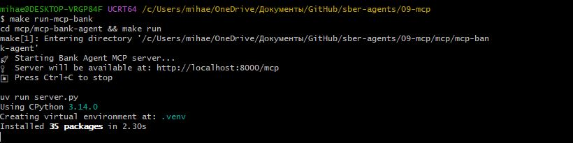

# Отчет о реализации MCP инструмента: Калькулятор доходности вклада

## 1. Какой новый инструмент вы реализовали?

Был реализован новый инструмент **`calculate_deposit_profit`** для MCP сервера банковского агента. Этот инструмент позволяет рассчитывать доходность банковских вкладов с учетом различных параметров.

### Основные возможности:
- Расчет итоговой суммы вклада на конец срока
- Расчет полученного дохода (прибыли)
- Расчет эффективной процентной ставки
- Поддержка капитализации процентов (ежемесячное начисление)
- Сравнение вариантов размещения (с капитализацией и без)

### Параметры инструмента:
- `initial_amount` (float) - начальная сумма вклада в рублях (минимум 1000 ₽)
- `annual_rate` (float) - годовая процентная ставка в процентах (0-100%)
- `term_months` (int) - срок вклада в месяцах (1-60 месяцев)
- `capitalization` (bool) - капитализация процентов (True/False, по умолчанию False)

## 2. Как работает ваш инструмент? Примеры использования

### Математические формулы

**Без капитализации (простые проценты):**
```
итоговая_сумма = начальная_сумма × (1 + годовая_ставка × срок_в_годах)
```

**С капитализацией (сложные проценты):**
```
итоговая_сумма = начальная_сумма × (1 + годовая_ставка/12)^(срок_в_месяцах)
```

**Эффективная ставка:**
```
эффективная_ставка = ((итоговая_сумма / начальная_сумма) - 1) × 100 / срок_в_годах
```

### Примеры использования

#### Пример 1: Вклад без капитализации
```
Запрос: "Рассчитай доходность вклада 100 тысяч рублей на год под 15% годовых"

Параметры:
- initial_amount: 100000
- annual_rate: 15.0
- term_months: 12
- capitalization: False

Результат:
- Итоговая сумма: 115,000.00 ₽
- Доход: 15,000.00 ₽
- Эффективная ставка: 15.00% годовых
```

#### Пример 2: Вклад с капитализацией
```
Запрос: "Сколько я получу, если положу 500 тысяч рублей на вклад под 18% годовых на 2 года с капитализацией?"

Параметры:
- initial_amount: 500000
- annual_rate: 18.0
- term_months: 24
- capitalization: True

Результат:
- Итоговая сумма: 715,373.50 ₽
- Доход: 215,373.50 ₽
- Эффективная ставка: 21.54% годовых
```

#### Пример 3: Сравнение вариантов
При выборе опции без капитализации инструмент автоматически показывает сравнение с вариантом с капитализацией, демонстрируя выгоду от ежемесячного начисления процентов.

### Формат вывода

Инструмент возвращает структурированный текстовый ответ с:
- Параметрами вклада (начальная сумма, ставка, срок, наличие капитализации)
- Результатами расчета (итоговая сумма, доход, эффективная ставка)
- Дополнительной информацией и сравнением (если применимо)

## 3. Подключали ли MCP сервер к другим клиентам? Как это работало?

Да, MCP сервер был подключен к банковскому агенту через LangChain MCP адаптеры.

### Архитектура подключения:

```
Telegram Bot → LangChain Agent → MCP Adapter → MCP Server (HTTP)
```

### Процесс работы:

1. **Пользователь отправляет запрос в Telegram бот**
   - Например: "Рассчитай доходность вклада 100 тысяч на год под 15%"

2. **LangChain Agent обрабатывает запрос**
   - Агент анализирует намерение пользователя
   - Определяет, что нужен расчет вклада
   - Выбирает подходящий инструмент из доступных MCP инструментов

3. **MCP Adapter вызывает инструмент**
   - Адаптер отправляет HTTP запрос к MCP серверу
   - Передает параметры инструмента в формате JSON
   - Получает результат выполнения

4. **MCP Server выполняет расчет**
   - Сервер обрабатывает запрос
   - Выполняет математические вычисления
   - Форматирует результат

5. **Результат возвращается пользователю**
   - Агент получает ответ от MCP сервера
   - Форматирует ответ для пользователя
   - Отправляет результат в Telegram

### Скриншоты работы:


*MCP сервер успешно запущен и готов к обработке запросов*

.JPG)
*Вызов инструмента через LangChain MCP адаптер в консоли*

.jpg)
*Результат расчета доходности вклада, отображенный пользователю в Telegram боте*

## 4. Какие преимущества MCP вы заметили?

### 1. **Модульность и разделение ответственности**
- MCP позволяет вынести специализированную логику (расчеты, внешние API) в отдельные серверы
- Основной агент остается легковесным и фокусируется на координации
- Легко добавлять новые инструменты без изменения кода агента

### 2. **Переиспользование инструментов**
- Один MCP сервер может обслуживать несколько клиентов
- Инструменты можно использовать в разных проектах
- Стандартизированный интерфейс упрощает интеграцию

### 3. **Независимое развертывание**
- MCP серверы можно запускать отдельно
- Легко масштабировать и обновлять независимо от основного приложения
- Можно использовать разные технологии для разных серверов

### 4. **Типизация и валидация**
- Pydantic модели обеспечивают строгую типизацию параметров
- Автоматическая валидация входных данных
- Четкая документация через Field descriptions

### 5. **Простота разработки**
- FastMCP framework упрощает создание инструментов
- Декораторы делают код читаемым и понятным
- Встроенная поддержка async/await

### 6. **Стандартизация**
- Единый протокол для всех MCP серверов
- Совместимость с различными клиентами (LangChain, Claude Desktop, и др.)
- Легкая интеграция через стандартные адаптеры

## 5. С какими сложностями столкнулись?

### 1. **Проблемы с совместимостью Python версий**

**Проблема:**
- Изначально использовался Python 3.14
- Многие зависимости (pydantic-core, jq) не поддерживали эту версию
- Ошибки при сборке Rust-расширений

**Решение:**
- Перешли на Python 3.13
- Удалили зависимость `jq`, заменили на стандартный JSON парсинг
- Сделали `ragas` опциональной зависимостью

### 2. **Зависимость от jq**

**Проблема:**
- `jq` требовался для парсинга JSON в `JSONLoader`
- Не собирался на Windows с Python 3.14
- Требовал компиляцию C-кода

**Решение:**
- Заменили `JSONLoader` с `jq_schema` на ручной парсинг JSON
- Использовали стандартную библиотеку Python `json`
- Создавали `Document` объекты вручную с метаданными

### 3. **Ограничения aiogram с pydantic**

**Проблема:**
- `aiogram` ограничивал версию `pydantic` до <2.12
- Для Python 3.14 требовался `pydantic>=2.12`
- Конфликт зависимостей

**Решение:**
- Использовали Python 3.13, который поддерживается текущими версиями зависимостей
- Ограничили версию Python в `pyproject.toml`: `requires-python = ">=3.11,<3.14"`

### 4. **Настройка MCP адаптера**

**Проблема:**
- Первоначальная настройка подключения MCP сервера к агенту
- Понимание формата конфигурации
- Настройка транспорта (streamable-http)

**Решение:**
- Изучили документацию LangChain MCP адаптеров
- Использовали правильный формат конфигурации в коде агента
- Убедились, что порты и URL настроены корректно

### 5. **Форматирование результатов**

**Проблема:**
- Нужно было обеспечить читаемый формат вывода
- Поддержка форматирования чисел (разделители тысяч)
- Структурированный вывод с эмодзи и разделами

**Решение:**
- Использовали форматирование строк с разделителями: `{amount:,.2f}`
- Добавили структурированные разделы с эмодзи для визуального разделения
- Реализовали сравнение вариантов для лучшего UX

## 6. Выводы и рекомендации

### Что получилось хорошо:
✅ Модульная архитектура с четким разделением ответственности  
✅ Простота добавления новых инструментов  
✅ Стандартизированный интерфейс  
✅ Хорошая типизация и валидация  
✅ Переиспользование кода между проектами  

### Что можно улучшить:
- Добавить кэширование результатов расчетов
- Реализовать поддержку разных валют (не только RUB)
- Добавить историю расчетов для пользователя
- Реализовать сравнение нескольких вкладов одновременно
- Добавить графики и визуализацию результатов

### Рекомендации для будущих проектов:
1. Использовать Python 3.13 или ниже для лучшей совместимости
2. Избегать зависимостей, требующих компиляции, если возможно
3. Делать опциональные зависимости действительно опциональными
4. Тестировать MCP инструменты изолированно перед интеграцией
5. Документировать все параметры и примеры использования

## 7. Технические детали реализации

### Структура кода:

```python
@mcp.tool(
    name="calculate_deposit_profit",
    description="Расчет доходности вклада с учетом капитализации процентов",
)
async def calculate_deposit_profit(
    initial_amount: Annotated[float, Field(...)],
    annual_rate: Annotated[float, Field(...)],
    term_months: Annotated[int, Field(...)],
    capitalization: Annotated[bool, Field(...)] = False
) -> str:
    # Реализация расчета
    ...
```

### Ключевые файлы:
- `mcp/mcp-bank-agent/server.py` - основной файл MCP сервера с инструментами
- `src/agent.py` - LangChain агент с интеграцией MCP
- `src/tools.py` - инструменты агента (включая RAG search)

### Зависимости:
- `mcp>=1.11.0` - FastMCP framework
- `pydantic>=2.4.1` - валидация параметров
- `langchain-mcp-adapters>=0.1.0` - адаптер для LangChain

---

**Дата создания отчета:** 2025-01-XX  
**Автор:** Реализация MCP инструмента для банковского агента  
**Версия:** 1.0

